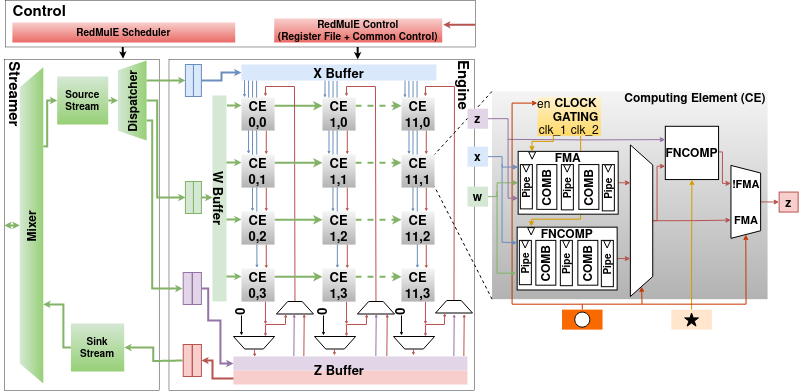
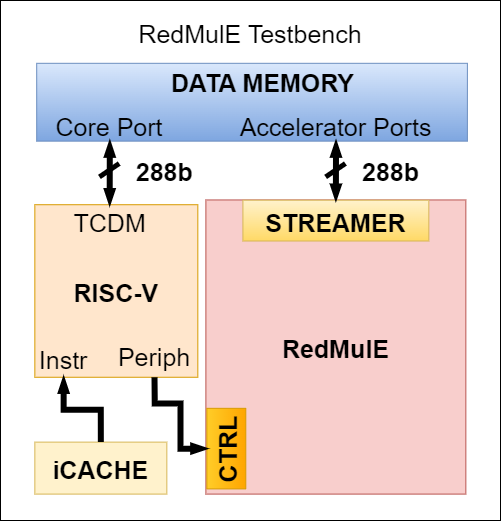
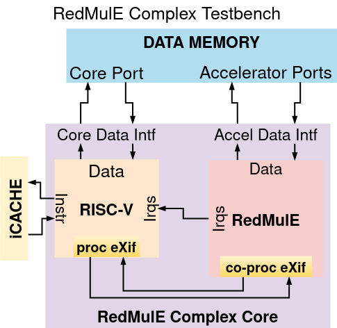

# ISOLDE
First time, install toolchain

```sh
make -f Makefile.tools
```
otherwise:  
```sh
. ./eth.sh 
```

## build simulation
top module can be configured in cmd line,VLT_TOP_MODULE=<top module name>, it defaults to **redmule_tb**, see [Makefile.verilator](Makefile.verilator)
```sh
make verilate
```
### get a clean slate
```sh
make veri-clean
```
## test simulation
only works if VLT_TOP_MODULE == tb_top_verilator
```sh
make verilate VLT_TOP_MODULE=tb_top_verilator
make sanity-veri-run
```
Output similar to:    
```
HELLO WORLD!!!
This is the OpenHW Group CV32E40P CORE-V processor core.
CV32E40P is a RISC-V ISA compliant core with the following attributes:
        mvendorid = 0x602
        marchid   = 0x4
        mimpid    = 0x0
        misa      = 0x40001104
        XLEN is 32-bits
        Supported Instructions Extensions: MIC

TOP.tb_top_verilator @ 130110: EXIT SUCCESS
- /home/uic52463/hdd2/isolde-project/redmule/tb/core/tb_top_verilator.sv:83: Verilog $finish
```
## build sw
get a clean slate
```sh
make sw-clean
```
```sh
make golden
make sw-build
```
the following files have been generated:  
* vsim/stim_instr.txt
* vsim/stim_data.txt

# RedMulE
RedMulE (**Red**uced-Precision Matrix **Mul**tiplication **E**ngine) is an open-source hardware accelerator based on the [HWPE](https://hwpe-doc.readthedocs.io/en/latest/index.html) template. It is designed to accelerate General Matrix-Matrix Operations (GEMM-Ops) on Floating-Point (FP) FP16 and FP8 input matrices. The keyword GEMM-Ops includes all the matrix operations of the kind **Z = (X op1 W) op2 Z**. The operators *op1* and *op2* can be any of those grouped in the following table:

|          Kernel           |  *op1*   |  *op2*  |           Res           |
| ------------------------- | -------- | ------- | ----------------------- |
|           GEMM            |    x     |    +    | *Z = (X x W) + Z*       |
| Maximum Critical Path     |    +     |   max   | *Z = max[(X + W), Z]*   |
| All-Pairs Shortest Paths  |    +     |   min   | *Z = min[(X + W), Z]*   |
| Maximum Reliability Path  |    x     |   max   | *Z = max[(X x W), Z]*   |
| Minimum Reliability Path  |    x     |   max   | *Z = min[(X x W), Z]*   |
| Minimum Spanning Tree     |   max    |   min   | *Z = min[max(X, W), Z]* |
| Maximum Capacity Tree     |   min    |   max   | *Z = max[min(X, W), Z]* |

To support GEMM-Ops with both FP8 and FP16 formats, RedMulE features input and output cast modules that allow for casting input matrices from FP8 to FP16 and the computed output matrix from FP16 to FP8. This allows for operating on larger internal precision guaranteeing enough accuracy during intermediate accumulations, for example during matrix multiplications.

## License and Citation
RedMulE is an open-source project and, wherever not explicitly stated, all hardware sources
are licensed under the SolderPad Hardware License Version 0.51, and all software sources
are licensed under the Apache License Version 2.0.
If you want to use RedMulE for academic purposes, please cite it as:

```
@article{TORTORELLA2023122,
title = {RedMule: A mixed-precision matrix�matrix operation engine for flexible and energy-efficient on-chip linear algebra and TinyML training acceleration},
journal = {Future Generation Computer Systems},
volume = {149},
pages = {122-135},
year = {2023},
issn = {0167-739X},
doi = {https://doi.org/10.1016/j.future.2023.07.002},
url = {https://www.sciencedirect.com/science/article/pii/S0167739X23002546},
author = {Yvan Tortorella and Luca Bertaccini and Luca Benini and Davide Rossi and Francesco Conti}
}
```

## Hardware Architecture
RedMulE is fully parametric and based on a 2-Dimensional array (*Engine*) of Computing Elements (CE) that operate in lock-step. The overall architecture is shown in the figure below.



RedMulE's *Engine* features a parametric number of CEs, that can be decided throught the *ARRAY_WIDTH* and *ARRAY_HEIGHT* parameters, and a parametric number of Pipeline Registers (*PIPE_REGS*) within each CE. The value of the *ARRAY_WIDTH* parameter is upper-bounded as it depends on the *ARRAY_HEIGHT* and the *PIPE_REGS* values. Its maximum value equals **ARRAY_HEIGHTxPIPE_REGS**, while the bitwidth of RedMulE's memory interface can be calculated as **ARRAY_HEIGHTx(PIPE_REGS+1)xnumbits(FP_FORMAT)**. *FP_FORMAT* corresponds always to the internal precision (FP16). For example, the default RedMulE configuration provides *ARRAY_HEIGHT*=4 and *PIPE_REGS*=3, resulting in a 256-bits memory port and in *ARRAY_WIDTH* $\le$ 12. Each CE contains a Fused Multiply-Add (FMA) and two FP Non Computation Operators (FNCOMP) to support all the GEMM-Ops grouped under the table above. The FMA and FNCOMP modules are adapted from the open-source [Transprecision Floating-Point Unit](https://github.com/openhwgroup/cvfpu).
RedMulE code is written in System Verilog and all its submodules are available under the `rtl` folder. The `rtl/redmule_pkg.sv` contains all the required parameters available to instantiate RedMulE.
RedMulE's dependencies are handled through [bender](https://github.com/pulp-platform/bender), but can also be managed through other tools.

## RedMulE Golden Model

The RedMulE Golden Model is intended to generate Floating-Point (FP) input and resulting matrices for all the General Matrix-Matrix Operations (GEMM-Ops) supported by RedMulE. The folder contains two subfolders for FP16 and FP8 golden model generation. Each folder contains a `script` folder to generate the model for all the supported GEMM-Ops, i. e. :
* addmax: Z = max((X + W), Z)
* addmin: Z = min((X + W), Z)
* gemm  : Z = (X x W) + Z
* maxmin: Z = min(max(X, W), Z)
* minmax: Z = max(min(X, W), Z)
* mulmax: Z = max((X x W), Z)
* mulmin: Z = min((X x W), Z)

### Generating Models
The golden model makes use of Python3.6 virtual environment, Numpy and Pytorch. These modules have
to be installed if they are not already present. To simplify this procedure, the `golden-model` folder
contains a `setup-py.sh` that can be sourced to install all these modules, and to export the
required environment variables. Thus, the first step is to move into the `golden-model` folder and run:
```bash
source golden-model/setup-py.sh
```

This will install a Python3.6 virtual environment under the `venv` folder.
The RedMulE Golden Model contains a `Makefile` that allows for easy golden matrices generation.
The parameters needed by such a Makefile are the following:
* M     : number of rows of the X, Y, and Z matrices;
* N     : number of columns of the X matrix, and as a consequence the number of rows of the W one;
* K     : number of columns of the W, Y, and Z matrices;
* fp_fmt: FP format, this can be FP16 or FP8;
* SW    : path to a folder to which it is desired to export the golden data as header files.

For example, if you want to generate the golden model for the MINMAX operation, using FP8 encoding,
under a local `inc` directory and using [96x64]*[64x64] matrices, first create the `inc` folder (`mkdir inc`) and then run:
```
make clean minmax M=96 N=64 K=64 fp_fmt=FP8 SW=$(pwd)/inc
```

A list of tested combinations of the M, N, and K parameters can be found in the `scripts/regression-list.sh` file.
Each execution of the RedMulE Golden Model also generates data in `.txt` format under the `golden-model`. The example showed above will generate a `minmax` folder containing a `txt` folder with
the generated matrices.

## RedMulE Testbench
RedMulE offers a complete testing environment under the `tb` folder, providing two different testbenches.

### HWPE memory-mapped interface
The `tb/redmule_tb.sv` is based on the [hwpe-tb](https://github.com/pulp-platform/hwpe-tb) example, and features a RedMulE instance, a [CV32E40P](https://github.com/pulp-platform/cv32e40p/tree/pulpissimo-v4.1.0) controller core, and dummy memories used to simulate instruction and data memories, as shown in the picture below.



In this configuration, RedMulE is connected to the core through a memory-mapped configuration interface based on the [hwpe-ctrl](https://github.com/pulp-platform/hwpe-ctrl). Through this interface, when the data request of the core is made to an address that corresponds to the accelerator register-file scope, the internal configuration registers of the accelerator are written to make it start an operation. This is the most typical implementation used for integration of tightly-coupled accelerators within a [PULP cluster](https://github.com/pulp-platform/pulp_cluster).

### Tensor co-processor with ISA extension
The `tb/redmule_complex_tb.sv` provides an implementatio of a complex core as an atomic unit. This unit features RedMulE as a tensor coprocessor of a [CV32E40X](https://github.com/openhwgroup/cv32e40x) core. In this configuration, the offloading of a matrix multiplication from the core to the accelerator is possible through the use of a general-purpose [eXtension Interface](https://github.com/openhwgroup/core-v-xif). Through such interface, it is possible to build a dedicated ISA instruction extension to offload an operation to an external co-processor without changing the core internal architecture. The RedMulE complex core is depicted in the figure below.



## Programming model
RedMulE is designed to reduce the effort required for the matrix multiplication tiling to the minimum. It features an internal hardware unit called "tiler" that needs very reduced input information (i.e. tesors dimensions, computing format, pointers to the input/output tensors and the operation to perform). Then, it is in charge of autonomously calculate the tiling of the tensors.
### HWPE memory-mapped programming
The offloading methods through the memory-mapped interface and the ISA extension work in the same way, meaning that offloading an operation to RedMulE only requires writing six configuration registers. These registers are listed below:

|  Register ID  |  Name                 | Offset |  Bits                           | Bitmask                                    | Content                                                   |
| ------------- | --------------------- | ------ | ------------------------------- | ------------------------------------------ |---------------------------------------------------------- |
| 0             | X Address             | 0x40   |  [31: 0]                        | 0xFFFFFFFF                                 | X Pointer                                                 |
| 1             | W Address             | 0x44   |  [31: 0]                        | 0xFFFFFFFF                                 | W Pointer                                                 |
| 2             | Z Address             | 0x48   |  [31: 0]                        | 0xFFFFFFFF                                 | Z Pointer                                                 |
| 3             | Matrix Config Reg 0   | 0x4C   |  [31:16] <br> [15:0]            | 0xFFFF0000 <br> 0x0000FFFF                 | K size <br> M size                                        |
| 4             | Matrix Config Reg 1   | 0x50   |  [31: 0]                        | 0xFFFFFFFF                                 | N size                                                    |
| 5             | Matrix Arithmetic Reg | 0x54   |  [14] <br> [12:10] <br> [9:7]   | 0x00004000 <br> 0x00001C00 <br> 0x00000380 | Custom Format (CFMT) <br> Op selection <br> In/Out Format (FMT) |

In the *Matrix Arithmetic Reg*, the *FMT* field allows to select if the input/output tensors are encoded with 8-bit or 16-bit. The intermediate products are always computed in the widest format available, which is [IEEE 754 FP16](https://en.wikipedia.org/wiki/Half-precision_floating-point_format) in this example, to guarantee enough precision during the accumulation. The *CFMT* field allows to enable custom formats: for example, if the *FMT* field is set to FP16 and *CMFT = 1*, RedMulE is configured to operate on [*bloat16*](https://en.wikipedia.org/wiki/Bfloat16_floating-point_format)-encoded inputs, while the intermediate accumulations are fixed to IEEE 754 FP16 precision. The *Op selection* field must be filled with one of the GEMM-Ops supported by RedMulE. GEMM-Ops must be enumerated, an example is available in the `sw/archi_redmule.h` file. The `sw/archi_redmule.h` contains a software description of RedMulE's architectuire such as the register-file map, the supported formats, and the available GEMM-Ops with the relative encoding.
The `sw/hal_redmule.h` is a Hardware Abstraction Layer (HAL) that contains some useful APIs that help simplifying RedMulE's programmability. The most important of these APIs is the `redmule_cfg` that is in charge of filling the configuration registers listed in the table above. It can be used as in the following:
```clike=
uint16_t m_size = M_SIZE;
uint16_t n_size = N_SIZE;
uint16_t k_size = K_SIZE;

uint8_t *x = x_inp;
uint8_t *w = w_inp;
uint8_t *y = y_inp;

redmule_cfg ((unsigned int) x, (unsigned int) w, (unsigned int) y,
             m_size, n_size, k_size,
             (uint8_t) GEMM,
             (uint8_t) Float16);
```
The `sw/hal_redmule.h` also contains other useful APIs for programming RedMulE, such as the `hwpe_soft_clear()` to provide a soft reset to all the internal accelerator state and configuration registers, or the `hwpe_trigger_job()` to trigger the accelerator operation after it is configured.
The `sw/redmule.c` provides an example of code for programming RedMulE through its memory-mapped interface.

### Tensor co-processor with ISA extension
The offloading mechanism through the dedicated ISA tensor extension requires the same information as in the memory-mapped case, meaning the pointers to the tensors, their dimensions, the encoding format, and the operation selection. All these pieces of information must be encapsulated into two dedicated ISA instructions: a `mcnfig` instruction and a `marith` instruction.

#### *mcnfig* Instruction
The *mcnfig* instruction features the opcode reserved in the `custom 0` encoding of the [RISC-V International Specifications](https://riscv.org/technical/specifications/). Such instruction also uses the `rs1` and `rs2` fields to share two registers of the core Register-File with the accelerator. The `rs1` and `rs2` registers must contain the same information as the *Matrix Config Reg 0* and the *Matrix Config Reg 1* of the memory-mapped interface. So the *mcnfig* instruction should look as in the following:

| Bit[31:25] | Bit[24:20] | Bit[19:15] | Bit[14: 7] | Bit[ 6: 0]        |
|------------|------------|------------|------------|-------------------|
| Free Field | `rs2` idx  | `rs1` idx  | Free Field | OpCode (**0x0B**) |

Regarding the content of the `rs1`, `rs2` retgisters, they must be such that:
* `rs1[31:16] <- K Size`
* `rs1[15: 0] <- M Size`
* `rs2[31: 0] <- N Size`

An example of execution of the *mcnfig* instruction and of the configuration of the `rs1` and `rs2` registers is shown below:
```clike=
uint16_t m_size = M_SIZE;
uint16_t n_size = N_SIZE;
uint16_t k_size = K_SIZE;

uint32_t cfg_reg0 = ((k_size << 16) | (m_size << 0));
uint32_t cfg_reg1 = (n_size << 0);

asm volatile ("addi t3, %0, 0" :: "r"(cfg_reg0));
asm volatile ("addi t4, %0, 0" :: "r"(cfg_reg1));

/* mcnfig instruction */
// asm volatile(
//      ".word (0x0       << 25) | \     /* Empty         */
//             (0b11101   << 20) | \     /* Rs2 (t4 here) */
//             (0b11100   << 15) | \     /* Rs1 (t3 here) */
//             (0x00      <<  7) | \     /* Empty         */
//             (0b0001011 <<  0)   \n"); /* OpCode        */
  
asm volatile(
     ".word (0x0       << 25) | \
            (0b11101   << 20) | \
            (0b11100   << 15) | \
            (0x00      <<  7) | \
            (0b0001011 <<  0)   \n");
```

#### *marith* Instruction
The *marith* instruction features the opcode reserved in the `custom 1` encoding of the [RISC-V International Specifications](https://riscv.org/technical/specifications/), and uses the `rs1`, `rs2`, and `rs3` fields to pass the pointers to the X, W, and Z matrices through three of the core's RF registers. The structure of the *marith* instruction is shown below:

| Bit[31:27] | Bit[26:25]   | Bit[24:20] | Bit[19:15] | Bit[14]     | Bit[13]    | Bit[12:10]   | Bit[ 9: 7] | Bit[ 6: 0]        |
|------------|--------------|------------|------------|-------------|------------|--------------|------------|-------------------|
| `rs3` idx  | Free Field   | `rs2` idx  | `rs1` idx  | CFMT Enable | Free Field | Op selection | FMT        | OpCode (**0x2B**) |

An example of execution of the *marith* instruction to offload a GEMM using FP16 tensors and of the configuration of the required `rs1`, `rs2`, and `rs3` registers is shown below:
```clike=
uint8_t *x = x_inp;
uint8_t *w = w_inp;
uint8_t *y = y_inp;

uint32_t x_addr = *(uint32_t *) &x;
uint32_t w_addr = *(uint32_t *) &w;
uint32_t y_addr = *(uint32_t *) &y;

asm volatile ("addi t0, %0, 0" :: "r"(x_addr));
asm volatile ("addi t1, %0, 0" :: "r"(w_addr));
asm volatile ("addi t2, %0, 0" :: "r"(y_addr));

/* arith instruction */
// sm volatile(
//     ".word (0b00111   << 27) | \     /* Rs3 (t2 here)                */
//            (0b00      << 25) | \     /* Empty                        */
//            (0b00110   << 20) | \     /* Rs2 (t1 here)                */
//            (0b00101   << 15) | \     /* Rs1 (t0 here)                */
//            (0b0       << 14) | \     /* Custom format enable/disable */
//            (0b0       << 13) | \     /* Widening enable/disable      */
//            (0b001     << 10) | \     /* Operation selection          */
//            (0b001     <<  7) | \     /* Data format                  */
//            (0b0101011 <<  0)   \n"); /* OpCode                       */

asm volatile(
     ".word (0b00111   << 27) | \
            (0b00      << 25) | \
            (0b00110   << 20) | \
            (0b00101   << 15) | \
            (0b0       << 14) | \
            (0b0       << 13) | \
            (0b001     << 10) | \
            (0b001     <<  7) | \
            (0b0101011 <<  0)   \n");
```
The `sw/redmule_complex.c` provides an example of code for programming RedMulE through a dedicate ISA extension.

### Getting Started
If you are working on ETH Lagrev servers, sourcing one of the setup scripts located under the `scripts` folder suffice to export all the required environment variables. Otherwise, it ise recommanded to install a riscv [toolchain](https://github.com/pulp-platform/pulp-riscv-gnu-toolchain) and do the following:
```bash
export PATH=/absolute/path/to/riscv/toolchain/bin:$PATH
export PULP_RISCV_GCC_TOOLCHAIN=/absolute/path/to/riscv/toolchain
export PATH=/absolute/path/to/gcc/bin:$PATH
```

The `scripts/setup-hwpe.sh` offers an example of bash script to export the required environment variables to test the HWPE memory-mapped configuration of the thesbench, while the `scripts/setup-complex.sh` does the same for the ISA extension-based configuration. There is also a `scripts/setup64.sh` that shows how the same can be done for a 64-bit toolchain.

Install bender by executing:
```bash
make bender
```
Bender installation is not mandatory. If any bender version is already installed, it is just needed to add the absolute path to the `bender` binary to the `PATH` variable. 

Clone the dependencies and generate the compilation script by running:
```bash
make update-ips
```

Build the hardware:
```bash
make hw-build
```

### Run the test

To run the available tests, just do:
```bash
make sw-build
make run (gui=1 to open the Questasim Graphic User Interface)
```
It is possible to run the test introducing a parametric probability of stall by explicitly passing the `P_STALL` parameter while running the test (`P_STALL=0.1` means a stall probability of the 10%).
If the `scripts/setup-hwpe.sh` was sourced, the above commands will execute the `sw/redmule.c` example, while if the `scripts/setup-complex.sh` was source, the above commands will execute the `sw/redmule_complex.c` test.

### Golden Model Generation
It is possible to generate fresh golden models directly from the `redmule` folder. The parameters that can be used to generate different golden models are the following:
* OP: this can be any of the GEMM-Ops supported by RedMulE (refer to the redmule-golde-model section);
* fp_fmt: FP format fot the generated matrices, it can either be FP16 or FP8;
* M, N, K: number of rows and columns of the generated matrices (refer to the redmule-golde-model section);
* SW: path to a folder to which it is desired to export the golden data as header files.

By default, the Makefile generates FP16 matrices for a GEMM operation, with M=12, N=16, K=16, and exports the generated header files under `sw/inc`. To generate a different golden model, let's say, for a MINMAX operation, using FP8 encoding and operating on [96x64]*[64x64] matrices, and exporting the header files under the `./inc` path, create the `inc` dir (`mkdir inc`) and then run:
```bash
make golden OP=minmax SW=$(pwd) M=96 N=64 K=64 fp_fmt=FP8
```
By removing the `SW=$(pwd)`, the same golden model is generated under `sw/inc`.

See you, space cowboy!
